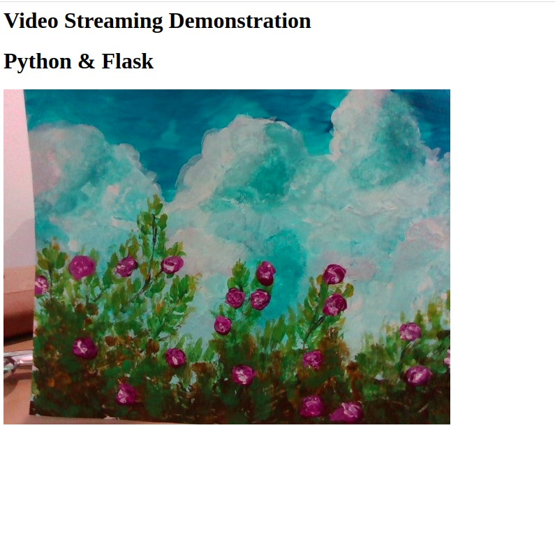

# Flask for Video Streaming
=====================
This is a basic example for streaming video coming from an Intel Realsense camera (D435).
It uses Flask, a micro web framework written in Python.

#Usage
```
git clone 
python app.py
```

Open a browser and go to 0.0.0.0:5000

#Result


#Reference
Based on the work of [Flask Video Streaming Revisited](http://blog.miguelgrinberg.com/post/flask-video-streaming-revisited).


